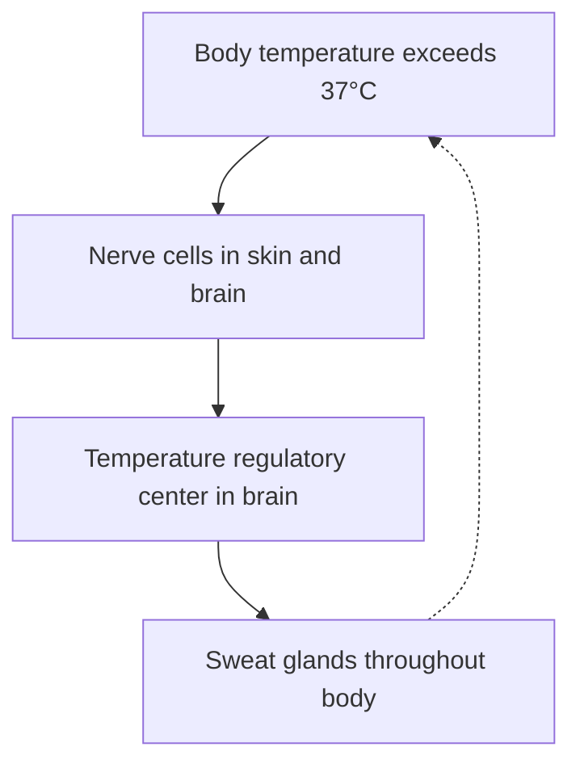

# pagespeak

[](https://pypi.org/project/pagespeak/)

Convert PDF, Word, and other office formats to LLM-friendly markdown — with diagram extraction to Mermaid.

## Why

pagespeak began as the ingestion step for a retrieval system built from a large, diverse body of real documents — equipment and software manuals, textbooks, how-to guides, and HTML help sites. Every off-the-shelf converter produced markdown that looked clean and retrieved badly: heading hierarchy flattened so it couldn't be split into coherent chunks, wide tables collapsed into one cell, diagrams reduced to image refs with no text, HTML entities left undecoded. The extraction looked finished; the output wasn't usable.

Nothing in the mainstream stack closes that gap — the usual answer is to ignore structure and split on a fixed token window. So pagespeak became the layer that does. It delegates extraction to Marker, Docling, or MarkItDown and adds the passes that prepare the output for LLM/RAG use — each one a fix for a specific way a real document broke, found by converting it and reading the output, one corpus defect at a time:

- **Diagrams → Mermaid, illustrations → labeled captions.** Extractors leave an embedded image with no text for retrieval to match. pagespeak sends each to a vision model: *structural* graphics (flowcharts, signal flow, state and sequence diagrams) become a tagged Mermaid block an LLM can read and edit; *morphological* figures where the picture itself is the information (labeled illustrations, micrographs, charts) instead get a dense caption that transcribes the visible labels. The original image is always kept beside it.
- **Heading repair, then section split.** It renormalizes flattened heading levels and splits the document into per-section files with in-text breadcrumbs, so each chunk carries its parent context.
- **Decoration stripping, content-keyed caching, cost controls, and an output audit.** `pagespeak audit` scans converted markdown for the defects above and reports them; it runs on any markdown tree, not just pagespeak's.

Extraction stays delegated — pagespeak does not try to out-parse Marker or Docling. Wide tables are the main weak spot: when Marker mangles a multi-column spec table — collapsing it into one cell, or splitting a wrapped cell across rows — `pagespeak repair-tables` re-reads just that page with Docling and splices the clean grid back in, either inline during conversion (`convert --repair-tables`) or standalone on an already-converted output, rather than re-converting the whole document.

That structure is the payoff. It lets a *compound, cross-document* question — one needing the right sections from several manuals at once — be answered from a few thousand relevant tokens, every step traceable to the manual it came from, instead of from documents too large to load.

It is new as a *public* project, not as code: these passes were hardened one real document at a time — convert, read the output, fix what broke — against a large working corpus well before this release. The worked examples below are the receipts.

> **See it on real documents — [docs/worked-examples.md](https://github.com/phierceweb/pagespeak/blob/main/docs/worked-examples.md).** One 18-page textbook chapter run through raw Marker, raw Docling, and pagespeak side by side (the heading-repair before/after, a real diagram→Mermaid, and a retrieval query the figure answers but the prose can't), then a 68-manual / ~6.1M-token library where one compound question is answered from ~1,600 retrieved tokens across three manuals — with the dated models and the honest misses reported, not hidden. It's the empirical case for everything above, and the best way to judge whether this fits your corpus.

## Scope — where pagespeak fits

pagespeak is the **ingestion and structuring** stage of a retrieval pipeline, not a whole one. It converts documents to clean, per-section markdown with breadcrumbs and provenance — and stops there. It does **not** do embeddings, vector storage, retrieval, or a query/chat layer; pair it with your own vector DB and retrieval framework (LlamaIndex, LangChain, Haystack, or hand-rolled).

One thing to know going in: the section split is **structural, not size-based**. Sections are cut at heading boundaries — there is no token budget, no max-chunk size, and no overlap. A long section stays one file; a near-empty one is dropped (`min_body_chars`). That makes each file a coherent, self-locating unit — which is what you want feeding an embedder — but if your retrieval needs uniformly-sized chunks, add a token-aware splitter downstream. The structure pagespeak recovers (correct heading levels, in-text breadcrumbs) is exactly what makes that downstream chunking clean.

## Install

```bash
pip install pagespeak                       # DOCX/PPTX/XLSX/HTML/CSV/JSON/...
pip install pagespeak[pdf]                  # adds Marker for PDF (default)
pip install pagespeak[pdf-docling]          # adds Docling for PDF (accuracy-first)
pip install pagespeak[pdf,pdf-docling]      # both — pick at call time
pip install pagespeak[docx-structured]      # adds python-docx for structure-faithful DOCX
pip install pagespeak[pdf,docx-structured]  # PDF + structure-faithful DOCX
pip install pagespeak[tophat]               # adds the Top Hat quiz-export backend (light; pypdfium2)
pip install pagespeak[web]                  # localhost web console (FastAPI + uvicorn)
```

Pagespeak builds on [`pf-core`](https://github.com/phierceweb/pf-core) ([PyPI](https://pypi.org/project/pf-core/)) for its LLM clients (Anthropic / Claude Code / OpenRouter), structured logging, pipeline manifest helpers, CLI subcommand factories, and atomic-write utilities. `pf-core[image-phash,tracking,llm]` is installed with it as a direct dependency — no separate install step required.

## Quickstart

```python
from pagespeak import to_markdown

result = to_markdown("manual.pdf", output_dir="./out", diagrams=True)

result.markdown   # final markdown with mermaid blocks embedded
result.images     # list[Path] of extracted images
result.diagrams   # list[Diagram(image_path, caption, mermaid, diagram_type)]
```

```bash
# One command: ingest + Phase 3 (cleanup, normalize, repair, structure, vision, split)
pagespeak convert manual.pdf -o ./out
pagespeak convert report.docx -o ./out --no-diagrams

# Two commands: backend phase separately, iterate Phase 3
pagespeak ingest thick.pdf -o ./out --workers 4   # chunked-parallel Marker
pagespeak convert ./out --normalize-headings      # Phase 3 on existing raw.md
```

For RAG-shaped output (split into per-section files with sensible defaults):

```bash
pagespeak convert manual.pdf -o ./out --preset rag-default
```

`rag-default`'s heading mode is `heuristic`, which is right for cleanly-numbered documents (textbooks, specs with `1.1`/`1.2` sections) — but it skips on **un-numbered manuals**, where it leaves the flattened hierarchy in place. For those (most product manuals and user guides), add the LLM heading-repair pass — this is the canonical recipe for un-numbered manuals:

```bash
pagespeak convert manual.pdf -o ./out --preset rag-default --normalize-headings-mode llm_full
```

See [docs/presets.md](https://github.com/phierceweb/pagespeak/blob/main/docs/presets.md) for the five built-in presets and [docs/choosing-defaults.md](https://github.com/phierceweb/pagespeak/blob/main/docs/choosing-defaults.md) for the per-document-type triage (when to add `llm_full`, `--device cpu`, page-ranging, and more).

## Output shape

For each diagram detected, the caption goes in the image's alt text and a tagged Mermaid block follows:

````markdown



````

- **Captions live in alt text** — extractable without parsing prose, read by screen readers.
- **Mermaid blocks tag their source image** with `pagespeak-image="<path>"` on the fenced-block info string. Renderers ignore the tag; parsers can pair Mermaid with the image it was generated from.
- **Non-structural images** — photos, screenshots, and morphological figures (labeled illustrations, micrographs, chemical structures, charts) — get a caption instead of Mermaid; label-bearing illustrations get a caption that transcribes their visible labels.
- **Repeated decorations** (page headers, footer logos) are detected via perceptual-hash clustering and stripped from the consolidated markdown.

> **See it on a real document:** [docs/worked-examples.md](https://github.com/phierceweb/pagespeak/blob/main/docs/worked-examples.md) runs one chapter of a CC-BY textbook through raw Marker, raw Docling, and pagespeak — the heading-repair before/after, a diagram→Mermaid, and a retrieval query the figure answers but the prose can't.

## Vision backends

| Backend | When to use | Auth |
|---|---|---|
| `claude_code` (default) | $0/call via a Claude Code subscription | `claude` binary on PATH |
| `anthropic` | Direct API; fastest | `ANTHROPIC_API_KEY` |
| `openrouter` | Multi-provider unified billing (Gemini, Llama vision, …) | `OPENROUTER_API_KEY` |

The default model is Claude Haiku 4.5 — $0 on the default `claude_code` backend, or typically $0.001–$0.005 per image on a paid backend. See [docs/diagrams.md](https://github.com/phierceweb/pagespeak/blob/main/docs/diagrams.md) for backend mechanics, prompt versioning, and failure handling.

Vision output is best-effort. A diagram's Mermaid is a model's *reading* of the image — usually faithful for clean structural figures, but it can be approximate or wrong on dense, hand-drawn, or low-resolution ones, and a confidently-wrong caption is worse than none. pagespeak keeps the original image beside every block, biases the prompt toward caption-only when a figure isn't cleanly structural, and for critical content you should spot-check the Mermaid against the source rather than trust it blindly. The worked examples report the real per-figure hit rate (e.g. organs named for 7 of 11 body systems), not a perfect one.

## Format support

| Format | Backend |
|---|---|
| `.pdf` | [Marker](https://github.com/VikParuchuri/marker) (default, fast) or [Docling](https://github.com/DS4SD/docling) (accuracy-first). See [docs/backends.md](https://github.com/phierceweb/pagespeak/blob/main/docs/backends.md). |
| `.docx`, `.pptx`, `.xlsx`, `.html`, `.htm`, `.csv`, `.json`, `.xml`, `.epub` | [MarkItDown](https://github.com/microsoft/markitdown) |
| Canvas QTI quiz export (directory or `.imscc`) | Built-in QTI backend → one markdown file per quiz with the answer key. See [docs/canvas-quizzes.md](https://github.com/phierceweb/pagespeak/blob/main/docs/canvas-quizzes.md). |
| Top Hat quiz-export PDF | `--pdf-backend tophat` → one `## Question N` block per question, correct answer marked when revealed, embedded figures extracted + captioned. See [docs/tophat-quizzes.md](https://github.com/phierceweb/pagespeak/blob/main/docs/tophat-quizzes.md). |

## How it relates to other tools

pagespeak is not a parser — it wraps existing extractors and runs cleanup, structuring, and diagram passes around their output.

| Tool | What it is | How pagespeak relates |
|---|---|---|
| [MarkItDown](https://github.com/microsoft/markitdown), [Marker](https://github.com/VikParuchuri/marker), [Docling](https://github.com/DS4SD/docling) | Open-source document → markdown extractors | Used as pagespeak's backends; pagespeak runs heading repair, section splitting, decoration stripping, and diagram→Mermaid on their output |
| LlamaParse, Reducto, Mathpix | Hosted, paid extraction APIs for complex documents | Different model — pagespeak runs locally on the extractors above, with optional $0 vision via Claude Code |
| Unstructured | Partitions documents into typed elements for RAG frameworks | Different output — pagespeak emits per-section markdown files with breadcrumbs and embedded Mermaid |

### Why a layer at all — heading fidelity

The hardest part of PDF→markdown for RAG is the heading tree, because that's what chunking splits on. PDFs don't store semantic heading levels — only font sizes — so every extractor *guesses*, and each flattens or mis-levels real documents in a different way:

| | Heading hierarchy | Tables | Figures / formulas |
|---|---|---|---|
| **Marker** (default) | 4-level pyramid in single-shot; **flattens in the chunked pipeline** (per-chunk font stats disagree). MPS crash on Apple Silicon → `--device cpu` | occasionally collapses a multi-column table into one cell | — |
| **Docling** | **capped at 2 levels by design** — its layout model labels every section heading `level=1` | well-formed, TableFormer-grade | ~25% more figures on textbooks; formula → LaTeX |

So no backend simply gets structure right, and "just use Marker" or "just use Docling" inherits that backend's specific failure. Recovering the structure is pagespeak's reason to exist: an optional LLM heading-renormalization stage rebuilds a flattened hierarchy, deterministic post-passes repair levels at $0, and `repair-tables` re-reads *just* a broken table's page through Docling and splices the clean grid back into Marker's output — one page, not a second full conversion. Pick the backend for its strengths; pagespeak patches its known weakness. The full trade-off and recipes: [docs/backends.md](https://github.com/phierceweb/pagespeak/blob/main/docs/backends.md) and [docs/choosing-defaults.md](https://github.com/phierceweb/pagespeak/blob/main/docs/choosing-defaults.md).

## Docs

- [docs/pipeline.md](https://github.com/phierceweb/pagespeak/blob/main/docs/pipeline.md) — stage-by-stage walkthrough of what every command runs (spine)
- [docs/worked-examples.md](https://github.com/phierceweb/pagespeak/blob/main/docs/worked-examples.md) — end-to-end before/after on real documents: extraction, repair, retrieval, and the cross-document payoff
- [docs/usage.md](https://github.com/phierceweb/pagespeak/blob/main/docs/usage.md) — library + CLI examples, kwargs, env vars, common recipes
- [docs/choosing-defaults.md](https://github.com/phierceweb/pagespeak/blob/main/docs/choosing-defaults.md) — pre-ingest triage: canonical recipe, vendor patterns, when to deviate
- [docs/presets.md](https://github.com/phierceweb/pagespeak/blob/main/docs/presets.md) — config presets and `<output>/.pagespeak-run.json`
- [docs/architecture.md](https://github.com/phierceweb/pagespeak/blob/main/docs/architecture.md) — module layout, data flow
- [docs/diagrams.md](https://github.com/phierceweb/pagespeak/blob/main/docs/diagrams.md) — vision pass, prompt versioning
- [docs/cleanup.md](https://github.com/phierceweb/pagespeak/blob/main/docs/cleanup.md) — cleanup levels, cross-refs, section splitting
- [docs/normalize-headings.md](https://github.com/phierceweb/pagespeak/blob/main/docs/normalize-headings.md) — heading-level renormalization
- [docs/audit.md](https://github.com/phierceweb/pagespeak/blob/main/docs/audit.md) — `pagespeak audit`: scan converted output for conversion defects (read-only, $0)
- [docs/repair-tables.md](https://github.com/phierceweb/pagespeak/blob/main/docs/repair-tables.md) — `pagespeak repair-tables`: splice Docling's clean grid into Marker-collapsed tables (the fix for the audit's `collapsed_table`)
- [docs/caching.md](https://github.com/phierceweb/pagespeak/blob/main/docs/caching.md) — cache layers, `--rerun-from`, baselines, diff
- [docs/backends.md](https://github.com/phierceweb/pagespeak/blob/main/docs/backends.md) — Marker vs Docling for PDF
- [docs/docx-backends.md](https://github.com/phierceweb/pagespeak/blob/main/docs/docx-backends.md) — MarkItDown vs python-docx for DOCX
- [docs/ingest.md](https://github.com/phierceweb/pagespeak/blob/main/docs/ingest.md) — `pagespeak ingest`, chunked-parallel workers, resume semantics
- [docs/format-support.md](https://github.com/phierceweb/pagespeak/blob/main/docs/format-support.md) — per-format quirks
- [docs/canvas-quizzes.md](https://github.com/phierceweb/pagespeak/blob/main/docs/canvas-quizzes.md) — Canvas QTI quiz exports → one markdown file per quiz
- [docs/tophat-quizzes.md](https://github.com/phierceweb/pagespeak/blob/main/docs/tophat-quizzes.md) — Top Hat quiz-export PDFs → per-question markdown (`--pdf-backend tophat`)
- [docs/operations.md](https://github.com/phierceweb/pagespeak/blob/main/docs/operations.md) — sandbox / `ProcessPoolExecutor` gotchas
- [docs/web.md](https://github.com/phierceweb/pagespeak/blob/main/docs/web.md) — web console: upload/queue, per-phase cockpit, cost gate, LLM observability

## Security

[SECURITY.md](https://github.com/phierceweb/pagespeak/blob/main/SECURITY.md) covers vulnerability reporting and safe-usage notes for shared environments (the console has no auth; remote-image fetching is SSRF-guarded).

## License

MIT.
