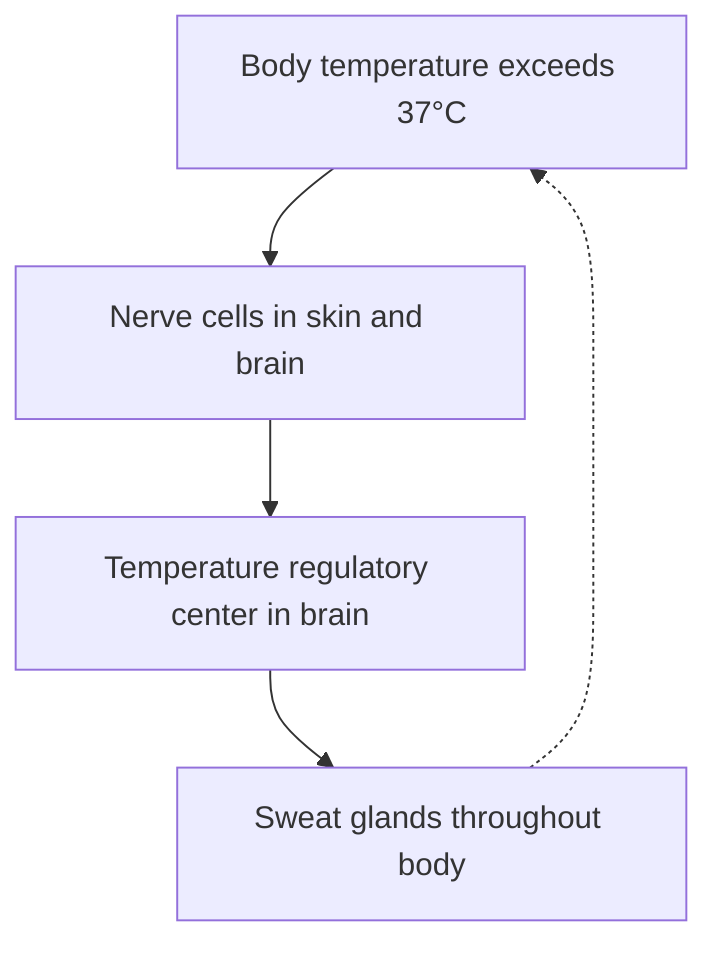

# Worked examples — what the repaired structure buys

Two real demonstrations of what pagespeak's repaired structure buys an LLM/RAG consumer.

**§1–§5 — one chapter, in full.** A freely-licensed textbook chapter through raw Marker, raw Docling, and pagespeak: the heading-repair before/after, a diagram→Mermaid, a retrieval comparison, and the breadcrumb routing that makes each chunk self-locating. Reproducible from the commands in [Reproduce it](#reproduce-it), with no hand-editing of the output; the source is OpenStax *Anatomy & Physiology* 1e, Chapter 1 (pages 17–34), CC BY 4.0 — see [Attribution](#attribution).

**§6 — the same properties at scale.** A real, anonymized 68-manual library: a compound, cross-document question answered from the right sections of several manuals at once — the payoff the structure exists for.

*Run 2026-06-16. Conversion + vision by pagespeak (vision model: Claude Haiku 4.5); the reasoning and retrieval tests in §4–§6 use Claude Opus 4.8 (`claude-opus-4-8`). Model capability is the fastest-moving variable here — read these results as a dated snapshot.*

## Summary

| | Raw **Marker** | Raw **Docling** | **pagespeak** (on Marker) |
|---|---|---|---|
| Body text | complete | complete | complete |
| Heading tree | chapter, every `1.x` section, **and** sidebars all at **H1**; sub-heads jump to H3/H4 | **everything H2** — no hierarchy at all | `# 1` → `## 1.1…1.6` → `### subsection` → `#### sidebar` |
| Bold defined terms (`**anatomy**`) | kept | **lost** | kept |
| Em-dashes / smart quotes | kept | **degraded** by OCR | kept |
| Cross-reference anchors | kept | **lost** | kept |
| Embedded diagram | opaque image ref | opaque image ref | **Mermaid block** + description |
| "List the 11 organ systems" (figure-only fact) | unanswerable | unanswerable | **answerable** from the figure description |

Neither extractor is "wrong" — they fail in *opposite* ways. Marker keeps the typography but emits an inconsistent tree; Docling flattens everything to one level and degrades the punctuation. pagespeak starts from Marker (the richer output, whose `1.1/1.2…` numbers give a repair signal), fixes the heading levels, and turns the figures into text.

> One honest non-result: the chapter-title *number-fusion* defect Marker produces on some textbooks (e.g. `# The Cell 2 Structure and Function`) did **not** appear here — OpenStax's `1 | An Introduction…` layout is clean. That defect is layout-specific, not universal.

## 1. Raw extraction — Marker vs Docling

Same 18 pages through each backend, no LLM, no cleanup.

**Marker** keeps formatting but the heading levels are inconsistent — the chapter, its numbered sections, and a sidebar box all land at H1, while sub-headings drop to H4:

```text
# **1 | AN INTRODUCTION TO THE HUMAN BODY**
# **1.1 | Overview of Anatomy and Physiology**      ← H1, sibling of the chapter
#### **Organization**                                ← H1 → H4 jump
# **Controlled Hypothermia**                         ← a sidebar box, promoted to H1
# **1.5 | Homeostasis**
#### **Negative Feedback**
```

**Docling** runs OCR and labels *every* heading the same level — there is no hierarchy to split on, and the typography is degraded:

```text
## 1 | AN INTRODUCTION TO THE HUMAN BODY              ← even the chapter title is H2
## 1.1 | Overview of Anatomy and Physiology
## Organization
## Negative Feedback
...anatomy is the scientific study...                 ← bold lost (Marker kept **anatomy**)
...a discrete body system-that is...                  ← em-dash → hyphen (OCR)
```

## 2. pagespeak — heading repair, then split

pagespeak continues from the Marker output: cleanup, then an LLM heading-repair pass (`llm_full`), then section splitting. The flat list becomes a real tree (16 of 25 headings re-levelled), and the splitter writes one file per section, nesting by the repaired levels:

```text
# 1 | AN INTRODUCTION TO THE HUMAN BODY
## 1.1 | Overview of Anatomy and Physiology
## 1.2 | Structural Organization of the Human Body
### The Levels of Organization
## 1.4 | Requirements for Human Life
### Narrow Range of Temperature
#### Controlled Hypothermia        ← sidebar correctly demoted under its section
## 1.5 | Homeostasis
### Negative Feedback
### Positive Feedback
```

```text
sections/1/
├── 1.2. Structural Organization of the Human Body.md
│   └── 1.2/The Levels of Organization.md
├── 1.4. Requirements for Human Life.md
│   └── 1.4/Narrow Range of Temperature/Controlled Hypothermia.md
└── 1.5. Homeostasis.md
    ├── 1.5/Negative Feedback.md
    └── 1.5/Positive Feedback.md
```

Each split file carries an in-text breadcrumb so the chunk is self-contained:

```text
> ↑ Anatomy And Physiology / 1. AN INTRODUCTION… / 1.2. Structural Organization…
```

## 3. A diagram becomes a Mermaid block

Figure 1.10 (the negative-feedback homeostasis loop) is just a JPEG in the raw output. pagespeak's vision pass writes a description into the image alt-text and a tagged Mermaid block beside it:

````text



````

The dashed edge back to `A` is the feedback — the loop structure an LLM can now read and reason over, instead of an opaque image.

## 4. Why it matters for retrieval

The prose in §1.2 says only: *"This book covers eleven distinct organ systems in the human body (Figure 1.4 and Figure 1.5)."* It never lists them — the list is inside the two figures. To see what that costs a reader, we put the **same question** to **Claude Opus 4.8** (`claude-opus-4-8`, run headless via the `claude` CLI) against the **same section** as produced by each of the three pipelines — raw Marker, raw Docling, and pagespeak. Using the most capable model is the point: if *it* can't recover the list from an extractor's output, the limit is the data, not the reader.

**Against raw Marker** (figure = bare image ref):

> "The source does **not** enumerate the eleven organ systems, and I cannot list them from it… it defers the actual list to **Figure 1.4** and **Figure 1.5**, which are images (`_page_21_Figure_2.jpeg` and `_page_22_Figure_2.jpeg`). … I cannot honestly provide either the eleven systems or example organs without the figure contents."

**Against raw Docling** (figure = bare image ref — the accuracy-first alternative):

> "The source does **not** enumerate the eleven organ systems, and does **not** name any organs within them… the actual list of the eleven systems is shown only in **Figure 1.4** and **Figure 1.5**, which appear as images (`_page_22_Picture_3.png` and `_page_23_Picture_4.png`). … I cannot list the systems or their organs from this source without reading the two figures."

Both extractors leave the figure opaque, so even Opus 4.8 can't answer from either — describing an image is not an extractor's job. **Docling replaces Marker, not pagespeak.**

**Against pagespeak** (vision described the figure):

> "All eleven can be assembled, but **only from the alt-text of Figures 1.4 and 1.5** — the prose itself just says 'eleven distinct organ systems' without naming them." — then it lists all eleven (integumentary, skeletal, muscular, nervous, endocrine → pituitary/thyroid/pancreas/adrenal…, cardiovascular → heart, lymphatic → spleen/thymus, respiratory → lungs/trachea, digestive → stomach/liver, urinary → kidneys, reproductive → testes/ovaries).

The model flags, unprompted, that the alt-text names organs for only 7 of the 11 systems — an honest limit of the vision pass, not a hidden one. Same question, three pipelines, one answerable result, because pagespeak turned the figure into text.

### And a search engine retrieves it

Those three runs are an LLM *reading* a chunk; the other half is *finding* it. We indexed the delivered `sections/` as a qmd collection and ran each question as a hybrid query — a BM25 keyword sub-query plus a semantic-vector sub-query, with qmd's LLM reranking — and took the relevance-scored top hit. For the figure-only facts, the chunk is found **because** vision turned the image into searchable text:

| Query | Top hit | Score |
|---|---|---|
| *which organ system includes the spleen?* | The Levels of Organization | **0.93** |
| *how does the body regulate temperature with negative feedback?* | Negative Feedback | **0.93** |
| *the eleven organ systems, one organ in each* | Structural Organization → The Levels of Organization | **0.93 → 0.56** |

For the first two, the text qmd matched on **is the figure description**: "spleen" appears nowhere in the prose — only in the Figure 1.5 alt-text (`Lymphatic System (thymus, lymph nodes, spleen, lymphatic vessels)`) — and the negative-feedback hit is the Figure 1.10 description, the same chunk that holds the Mermaid loop. The scores land in a strong retrieval band — §6 shows the same on a far larger library — and the matched text did not exist in the raw extractor output.

## 5. Hierarchy and breadcrumbs: why they pay off

Repairing the headings (§2) isn't cosmetic — it's what makes each chunk self-locating and the whole document navigable on a tiny token budget. Three measurable payoffs, on this one chapter (token counts approximate, chars/4):

### Less context per query

| | tokens | share of the chapter |
|---|---|---|
| One targeted chunk + breadcrumb | ~404 | 3.2% |
| The whole breadcrumb map (all 25 sections) | ~190 | 1.5% |
| The whole chapter | ~12,600 | 100% |

A targeted query retrieves a ~400-token chunk, not the ~12,600-token chapter — and the document's *entire* navigable structure fits in ~190 tokens.

That ~400 is the section's *natural* size, not a configured chunk length: pagespeak splits on heading boundaries, not a token budget, so chunk size tracks section size (a long section stays one file). The win demonstrated here is *which* text is retrieved and that it carries its location — not a tuned length. If your embedder needs uniformly-sized chunks, run a token-aware splitter over these section files; the repaired headings and breadcrumbs are what make that downstream pass clean.

### A chunk knows where it lives

Each split file carries its parent path as an in-text breadcrumb. Handed the generically-titled "Organization" subsection alone and asked where it belongs, Claude Opus 4.8 places it exactly:

> "Anatomy & Physiology → Chapter 1 → §1.3 Functions of Human Life → Organization."

Strip the breadcrumb from the *same chunk* and the same model can't:

> "Source: not determinable. Chapter: not determinable. Parent section: not determinable."

It still recognises the topic (cells, internal compartments) — but not *where it sits*. Placement is exactly what the breadcrumb supplies; content alone does not.

### Relating sections without reading them

Give a model *only* the breadcrumb map — the ~190-token list of nested paths, no section bodies — and ask which sections explain how the body stays stable and responds to change, how they relate, and in what order to read them. From paths alone, Opus 4.8 selects §1.5 Homeostasis (+ Negative/Positive Feedback), §1.4 Requirements (+ its temperature/pressure case studies), and §1.3 Responsiveness; works out the sibling/child relationships; and proposes a reading order (*responsiveness → the regulated variables → the mechanism*) — noting on its own that it is reasoning from structure, not content.

That caveat is the design intent, not a limitation: the map is a **cheap router**. An agent reasons over the hierarchy in ~1.5% of the document's tokens to decide *which* chunks to fetch, then spends real context only on those.

The same mechanism extends across a *set* of documents — provenance frontmatter plus stable, consistent section paths let an agent route across many docs the way it routes within one. §6 shows exactly that, on a real multi-manual library.

## 6. The payoff: one question, many manuals

This is the reason for the hierarchy, the breadcrumbs, and the split. A real question is rarely a single lookup — it is compound and spans products:

> *"In my DAW, sidechain a plug-in triggered by another track — using the plug-in's own external side-chain — while recording and monitoring through my audio interface. And what about latency?"*

No single manual answers that. One query against the library (**68 audio-equipment manuals · ~12,500 documents · ~6.1M tokens**) surfaces the assembly-ready pieces from **six sections across three makers' manuals** — the DAW's side-chain routing and monitoring/latency notes, the plug-in's external side-chain steps, the interface's direct-monitor workaround — each tagged by its breadcrumb. (Scores run 0.35–0.45 here, not the 0.93 of a single-section lookup: a compound query has no one perfect chunk, so relevance spreads across the partial matches — and the right pieces still surface.)

Fed **only those retrieved sections** (no outside knowledge), the model assembles an ordered procedure and **cites every step's source manual**:

> "Click the Side Chain pop-up menu in the plug-in's header area *[the DAW's guide — Choose a source for a side-chain signal]* … enable the plug-in's external side-chain and pick the trigger track *[the plug-in's manual — External side-chaining]* … the interface's control software can source the monitor feed directly from its inputs to dodge buffer latency — and mute the DAW tracks you're recording, or you'll hear yourself twice *[the interface manual — A note about latency]*."

Because each chunk self-identifies, it also **flags the gaps instead of inventing them**: *"the control-software setup steps aren't in these sections — that manual defers to its companion guide; whether the plug-in adds its own lookahead latency isn't addressed."*

### Why this is the point — context, then capability

That whole answer was assembled from **~1,600 tokens** of retrieved context. The three manuals it drew from total **~727,000 tokens** of full markdown (~696K + ~23K + ~8K) — **~458× more**, and far past any single context window. So the structure doesn't just make a cross-manual answer *cheaper* — it makes it *possible*:

- **It fits.** ~1.6K relevant tokens instead of ~727K of full manuals — the difference between "reason over it" and "won't load."
- **It's traceable.** Every step cites the manual it came from, because each chunk carries its breadcrumb — an auditable answer, not a blended guess.
- **It's bounded.** The model knows what it *doesn't* have and says so, because each chunk self-identifies — no quiet fabrication.

### The cheap-context property holds at every scale

Even single-concept lookups stay tiny — a section, never the whole manual:

| Query | Score | Section | Full manual | Saved |
|---|---|---|---|---|
| *parallel compression* | 0.93 | ~470 tok | ~180,000 tok | ~380× |
| *noise-gate setup* | 0.93 | ~200 tok | ~154,000 tok | ~767× |
| *sidechain ducking* | 0.93 | ~640 tok | ~8,900 tok | ~13× |

The reduction tracks the manual's size — largest exactly where it matters, on the manuals too big to fit in a context window:

| Full manual (anonymized) | Full markdown |
|---|---|
| a major DAW's official user guide | **~696,000 tok** |
| a DAW handbook | ~180,000 tok |
| a guitar-amp profiler | ~154,000 tok |
| a pitch-editor reference | ~148,000 tok |
| an entry-level DAW | ~118,000 tok |
| a live-performance host | ~107,000 tok |

*Corpus experiment run 2026-06-16: retrieval via qmd (hybrid BM25 + vector + rerank); synthesis by Claude Opus 4.8 (`claude-opus-4-8`). The manuals are commercial and stay private — only structural numbers (corpus size, scores, token counts) are reported. Token counts approximate, chars/4. Model capability moves fast; read this as a dated snapshot.*

## Reproduce it

Needs `pagespeak[pdf,pdf-docling]` and a vision backend (the default `claude_code` is $0). Download the source PDF from <https://openstax.org/details/books/anatomy-and-physiology> first.

```bash
# 1. Raw extraction, each backend (no LLM, $0). Chapter 1 = 0-based pages 16–33.
pagespeak convert anatomy-and-physiology.pdf -o out/marker \
    --pdf-backend marker  --page-range 16-33 --device cpu --stop-after ingest
pagespeak convert anatomy-and-physiology.pdf -o out/docling \
    --pdf-backend docling --page-range 16-33 --device cpu --stop-after ingest

# 2. pagespeak Phase-3 on the Marker output (heading-repair + vision + split).
#    Reuses the ingest above, so Marker doesn't run twice.
pagespeak convert out/marker --from cleanup --preset rag-default \
    --normalize-headings --normalize-headings-mode llm_full
```

`--device cpu` avoids the surya/MPS crash on Apple Silicon; drop it elsewhere.

## Attribution

**§1–§5** reproduce and adapt content from **OpenStax,** *Anatomy & Physiology* (1st edition), Chapter 1. ©2017 Rice University, licensed under a [Creative Commons Attribution 4.0 International License (CC BY 4.0)](https://creativecommons.org/licenses/by/4.0/).

> Download for free at <https://openstax.org/details/books/anatomy-and-physiology>.

The OpenStax-derived Markdown in §1–§5 (raw extractions, the repaired output, sections, and breadcrumbs) is a derivative of that CC BY 4.0 work and is therefore also offered under CC BY 4.0 — not the MIT license that covers pagespeak's own source. The vision-written image descriptions and Mermaid blocks were produced by pagespeak.

**§6** draws on a private library of commercial audio-equipment manuals. Those manuals are **not** reproduced here and remain under their respective publishers' copyright — only anonymized structural numbers (corpus size, relevance scores, token counts) and a few short, product-genericized quotations (for commentary/demonstration) appear. No product names are used.
